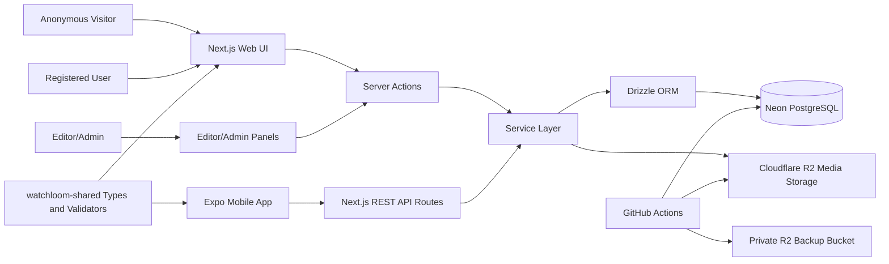
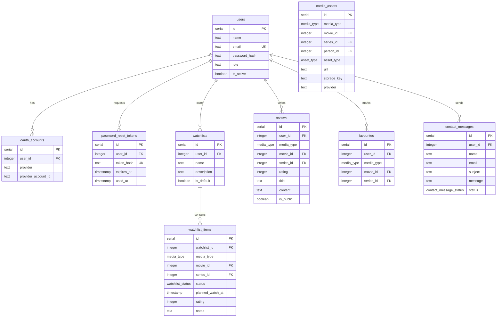

# Watchloom

Watchloom is a multi-platform full-stack movie and TV series catalog application. It provides a complete public catalog experience, authenticated user functionality, role-based catalog administration, a mobile client, external metadata integration, file storage, automated backups, and automated testing workflows.

The project is built as a Node.js monorepo containing:

* `watchloom-web` — Next.js web application, backend API, server actions, services, database schema, migrations, tests, and deployment configuration.
* `watchloom-mobile` — Expo React Native mobile application for regular users.
* `watchloom-shared` — shared TypeScript types, constants, validators, and reusable cross-platform logic.
* `.github` — GitHub Actions workflows for CI/testing and automated backups.
* `docs` — additional documentation such as backup and mobile MVP checklists.

Watchloom is designed as a real-world client-server system where the Next.js app acts both as the web client and backend API provider, while the Expo mobile app communicates with the backend through REST API routes.

---

## Table of Contents

1. Project Goals
2. Main Features
3. User Roles
4. Architecture Overview
5. Repository Structure
6. Technology Stack
7. Database Design
8. Authentication and Authorization
9. Web Application
10. Mobile Application
11. API Overview
12. File Storage with Cloudflare R2
13. TMDb Integration
14. Automated Backups
15. Testing and CI
16. Deployment
17. Local Development Setup
18. Environment Variables
19. Useful Commands
20. Demo Accounts
21. Manual QA Checklist
22. Future Improvements
23. Development Guidelines

---

## 1. Project Goals

The main goal of Watchloom is to demonstrate a production-style full-stack application with both web and mobile clients.

The project focuses on:

* Building a realistic movie and TV series catalog.
* Supporting anonymous browsing.
* Supporting authenticated user-specific features.
* Implementing role-based authorization for users, editors, and admins.
* Managing a large relational PostgreSQL database.
* Using real external metadata from TMDb.
* Uploading and serving poster images through Cloudflare R2.
* Providing a mobile app with planned-watch reminders.
* Automating tests, database backups, and deployment processes.
* Maintaining a clean modular architecture with services, actions, reusable components, and shared types.

---

## 2. Main Features

### Public Catalog

Anonymous visitors can:

* Browse movies.
* Browse TV series.
* Search the catalog.
* Filter catalog data by supported query parameters.
* View movie details.
* View TV series details.
* View seasons and episodes.
* Read public reviews.
* Access static pages such as About and Contact.

### Authenticated User Features

Registered users can:

* Create and manage personal watchlists.
* Add movies and series to watchlists.
* Set watch status:

  * `watched`
  * `watching`
  * `to_watch`
* Add planned watch date/time.
* Rate movies and series.
* Add notes to watchlist items.
* Add favourites.
* Write public or private reviews.
* Edit and delete their own reviews.
* Access a protected dashboard.
* Use the mobile app to manage user-facing functionality.

### Editor Features

Editors can:

* Access the editor panel.
* Create, update, and delete movies.
* Create, update, and delete TV series.
* Manage seasons for each series.
* Manage episodes for each season.
* Upload poster files through Cloudflare R2.
* Edit catalog metadata.
* Manage genre and people relations where supported.

### Admin Features

Admins can:

* Access the admin panel.
* Manage users.
* Change user roles.
* Activate or deactivate users.
* Promote regular users to editors.
* Manage contact messages.
* Handle editor access requests.
* Access catalog overview tools.
* Use all editor-level catalog management features.

### Mobile Features

The Expo mobile app supports:

* Login and registration.
* Secure token storage.
* Profile and logout.
* Movies catalog.
* Series catalog.
* Movie details.
* Series details.
* Season episode lists.
* Watchlists.
* Favourites.
* Reviews.
* Planned watching.
* Local notifications for planned watch reminders.

---

## 3. User Roles

Watchloom uses role-based access control.

### Anonymous Visitor

Anonymous visitors can browse public content but cannot create or modify personal data.

Allowed:

* Home page
* Movies catalog
* Series catalog
* Details pages
* Public reviews
* About page
* Contact page

Not allowed:

* Dashboard
* Watchlists
* Favourites management
* Review creation
* Editor panel
* Admin panel

### User

Regular authenticated users can manage their own personal content.

Allowed:

* User dashboard
* Watchlists
* Watchlist items
* Planned watching
* Favourites
* Own reviews
* Profile/logout

Not allowed:

* Editor catalog management
* Admin user management
* Role management

### Editor

Editors are trusted catalog managers.

Allowed:

* All regular user features
* Editor panel
* Movie CRUD
* Series CRUD
* Season management
* Episode management
* Poster uploads

Not allowed:

* Admin user management
* Role management
* Admin-only contact message handling, unless explicitly allowed

### Admin

Admins have full application control.

Allowed:

* All regular user features
* All editor features
* Admin panel
* User management
* Role management
* Contact message management
* Catalog overview
* Backup/operational awareness through configured workflows

---

## 4. Architecture Overview

Watchloom follows a client-server architecture.

The web application is implemented with Next.js and contains both:

* browser-facing web pages
* backend API routes

The mobile application is implemented with Expo and communicates with the Next.js backend using REST API calls.

The backend business logic is organized into services. Server Actions and API route handlers call the service layer instead of directly embedding database logic in UI or route files.

### System Architecture Diagram



### High-Level Flow

```txt
Anonymous/User Browser
        |
        v
Next.js Web UI
        |
        v
Server Actions
        |
        v
Service Layer
        |
        v
Drizzle ORM
        |
        v
Neon PostgreSQL
```

```txt
Expo Mobile App
        |
        v
Next.js REST API Routes
        |
        v
Service Layer
        |
        v
Drizzle ORM
        |
        v
Neon PostgreSQL
```

```txt
Editor/Admin UI
        |
        v
Server Actions / Protected API
        |
        v
Service Layer
        |
        v
Neon PostgreSQL + Cloudflare R2
```

---

## 5. Repository Structure

```txt
WatchloomApp/
  .github/
    workflows/
      test.yml
      backup.yml
    scripts/
      run-backup.sh
      apply-backup-retention.sh

  docs/
    backups.md
    mobile-mvp-checklist.md

  watchloom-web/
    src/
      app/
        api/
        dashboard/
        editor/
        admin/
        movies/
        series/
        login/
        register/
        forgot-password/
        reset-password/
      actions/
      components/
      db/
      lib/
      services/
      middleware.ts
    db/
      scripts/
    drizzle/
    test/
    drizzle.config.ts
    package.json
    .env.example

  watchloom-mobile/
    app/
      (auth)/
      (tabs)/
      movies/
      series/
      watchlists/
    src/
      components/
      config/
      constants/
      hooks/
      lib/
      providers/
      services/
      types/
    app.json
    eas.json
    package.json
    .env.example

  watchloom-shared/
    src/
    package.json

  AGENTS.md
  README.md
  package.json
  package-lock.json
  tsconfig.base.json
```

---

## 6. Technology Stack

### Web and Backend

* Next.js App Router
* React
* TypeScript
* Tailwind CSS
* Server Components
* Server Actions
* REST API routes
* JWT authentication
* Google OAuth
* Password reset flow
* Zod validation
* Service-layer business logic

### Database

* Neon PostgreSQL
* Drizzle ORM
* Drizzle Kit migrations
* SQL indexes and constraints
* Seed scripts
* TMDb-powered catalog expansion scripts

### Mobile

* Expo
* React Native
* Expo Router
* Expo Secure Store
* Expo Notifications
* Typed API service modules

### Storage

* Cloudflare R2
* S3-compatible API
* AWS SDK S3 client
* Public media bucket for posters
* Private backup bucket for backups

### Automation

* GitHub Actions
* Jest unit tests
* Jest integration tests
* Playwright e2e tests
* Scheduled database and file storage backups

### Deployment

* Netlify for web/backend deployment
* Netlify optional Expo web deployment
* Expo EAS for Android APK builds
* GitHub Releases for APK distribution

---

## 7. Database Design

The database is relational and organized around catalog data, user data, role-based functionality, and media assets.

### Core Catalog Tables

Main catalog entities:

* `movies`
* `series`
* `seasons`
* `episodes`
* `genres`
* `people`

Catalog relationship tables:

* `movie_genres`
* `series_genres`
* `movie_people`
* `series_people`

### Movie Fields

Movies store:

* title
* slug
* description/overview
* release year
* duration
* director
* writer
* cast
* poster URL
* backdrop URL
* timestamps

### Series Fields

Series store:

* title
* slug
* description/overview
* release year
* status
* network/platform
* creator
* cast
* poster URL
* backdrop URL
* timestamps

### Seasons and Episodes

Each series can have multiple seasons.

Each season can have multiple episodes.

Season data includes:

* series ID
* season number
* title
* release year
* poster URL

Episode data includes:

* season ID
* episode number
* title
* description
* duration
* air date where supported

### User Feature Tables

Authenticated user functionality is stored in:

* `users`
* `oauth_accounts`
* `password_reset_tokens`
* `watchlists`
* `watchlist_items`
* `favourites`
* `reviews`
* `contact_messages`
* `media_assets`

### Core Catalog ER Diagram


### User Feature ER Diagram



### Important Constraints

The schema includes constraints and indexes for:

* unique user emails
* unique movie slugs
* unique series slugs
* unique genre slugs
* unique people slugs
* duplicate prevention in many-to-many relation tables
* rating bounds
* watchlist ownership
* movie-or-series media references
* cascading deletes for related series/seasons/episodes where configured

---

## 8. Authentication and Authorization

Watchloom includes a complete authentication and authorization system.

### Supported Authentication Methods

* Email/password registration
* Email/password login
* JWT-based sessions
* Google OAuth login
* Password reset flow

### Password Security

Passwords are never stored in plain text.

The application hashes passwords before storing them in the database.

Password reset tokens are stored as hashes, not as raw tokens.

### JWT Sessions

JWT tokens include the minimum user data required for authentication and authorization:

* user ID
* email
* role

Protected API routes and Server Actions use the authenticated user context to verify access.

### Google OAuth

Google OAuth allows users to sign in with a Google account.

The flow:

1. User clicks "Continue with Google".
2. App redirects to Google.
3. Google redirects back to `/api/auth/google/callback`.
4. Backend verifies the OAuth response.
5. User is created or linked.
6. App creates a normal Watchloom session.
7. User is redirected to the dashboard.

### Password Reset

The password reset flow includes:

1. User submits email.
2. App generates a secure random token.
3. Only a hash of the token is stored.
4. Reset link is generated.
5. User submits new password with token.
6. Token is validated.
7. Password is updated.
8. Token is marked as used.

The reset endpoint does not reveal whether an email exists.

### Authorization Rules

Authorization is enforced server-side.

Route and action access is based on role:

* `user`
* `editor`
* `admin`

Client UI hiding is only a convenience. Real protection happens in middleware, Server Actions, services, and API routes.

---

## 9. Web Application

The web application is the primary full-featured client.

### Public Pages

* Home
* Movies
* Series
* Movie details
* Series details
* Season episodes
* About
* Contact

### Auth Pages

* Login
* Register
* Forgot password
* Reset password
* Google OAuth callback handling

### User Dashboard

The user dashboard includes:

* overview
* watchlists
* watchlist details
* planned watching
* favourites
* reviews
* profile-related actions

Users can manage only their own data.

### Editor Panel

The editor panel includes catalog management tools.

Editors can:

* create movies
* edit movies
* delete movies
* create series
* edit series
* delete series
* manage seasons
* manage episodes
* upload posters

The editor panel is accessible only to users with `editor` or `admin` role.

### Admin Panel

The admin panel includes administrative tools.

Admins can:

* view user list
* search/filter users
* view user details
* change user roles
* activate/deactivate users
* manage contact messages
* promote users to editors
* view catalog overview

The admin panel is accessible only to users with `admin` role.

---

## 10. Mobile Application

The mobile app is a focused regular-user client.

It does not include admin or editor features.

### Mobile App Features

* login
* register
* secure token storage
* profile/logout
* home screen
* movies list
* series list
* movie details
* series details
* seasons and episodes
* watchlists
* add to watchlist
* update watchlist item status
* planned watching
* local notifications
* favourites
* reviews

### Mobile Authentication

The mobile app stores JWT access tokens securely using Expo Secure Store.

On startup:

1. Token is loaded from secure storage.
2. App calls `/api/auth/me`.
3. If token is valid, user state is restored.
4. If token is invalid, token is deleted.

### Mobile Notifications

Planned watching reminders are implemented with Expo Notifications.

Users can schedule reminders for watchlist items that have a planned watch date.

When a notification is tapped, the app navigates to the planned watching area or a relevant fallback screen.

---

## 11. API Overview

The backend exposes REST API routes under the Next.js app.

Main API groups:

```txt
/api/auth/*
/api/movies
/api/movies/[slug]
/api/series
/api/series/[slug]
/api/series/[slug]/seasons
/api/seasons/[seasonId]/episodes
/api/watchlists
/api/watchlists/[watchlistId]
/api/watchlists/[watchlistId]/items
/api/watchlist-items/[itemId]
/api/favourites
/api/reviews
/api/genres
```

### Auth API

Used for:

* register
* login
* logout
* current user
* password reset
* Google OAuth

### Catalog API

Used for:

* movie lists
* movie details
* series lists
* series details
* seasons
* episodes
* genres
* search and pagination

### User API

Used for:

* watchlists
* watchlist items
* favourites
* reviews
* planned watching

### Admin/Editor API or Server Actions

Admin and editor workflows are handled through protected server actions and/or API routes depending on the specific feature.

---

## 12. File Storage with Cloudflare R2

Watchloom uses Cloudflare R2 for media storage.

### Media Bucket

The public media bucket stores poster files uploaded by editors and admins.

Uploaded posters are saved to R2 and the resulting public URL is stored in the database.

The application stores:

* public URL
* storage key
* provider
* asset type
* related movie/series/person reference

### Upload Rules

Poster upload validation includes:

* only image files
* JPEG, PNG, WebP support
* file size limits
* server-side validation
* server-side authorization
* R2 credentials never exposed to the browser

Only editors and admins can upload posters.

---

## 13. TMDb Integration

Watchloom integrates with TMDb to seed and enrich catalog data.

TMDb scripts support:

* fetching real movie metadata
* fetching real TV series metadata
* fetching poster URLs
* fetching seasons
* fetching episodes
* fetching runtime and descriptions where available
* avoiding duplicate records
* using batch-based imports
* dry-run mode
* limit-based execution

### TMDb Data Used

For movies:

* title
* overview
* release year
* runtime
* director
* writer
* cast
* genres
* poster URL
* backdrop URL

For series:

* title
* overview
* release year
* status
* network/platform
* creator
* cast
* genres
* poster URL
* backdrop URL
* seasons
* episodes

### Script Safety

Maintenance scripts are designed to be:

* idempotent
* batch-friendly
* duplicate-safe
* tolerant of failed external API calls
* careful with rate limits
* safe to run manually

---

## 14. Automated Backups

Watchloom includes automated database and file storage backups.

The backup workflow is implemented through GitHub Actions.

### What Is Backed Up

The workflow backs up:

* Neon PostgreSQL database as compressed `.sql.gz`
* Cloudflare R2 media bucket as `.zip`

### Where Backups Are Stored

Backups are uploaded to a private Cloudflare R2 backup bucket.

### Schedule

The workflow runs automatically once per day.

It can also be started manually from GitHub Actions.

### Retention Policy

The backup retention policy keeps:

* 7 daily backups
* 5 weekly backups
* 12 monthly backups

Older backup files are deleted automatically from the backup bucket.

The workflow never deletes files from the source media bucket.

### Backup Structure

Example storage structure:

```txt
database/daily/
database/weekly/
database/monthly/

storage/daily/
storage/weekly/
storage/monthly/
```

### Restore Example

To restore a database dump:

```bash
gunzip -c watchloom-db-daily-YYYY-MM-DD.sql.gz | psql "$DATABASE_URL"
```

Restoring to production should be done carefully.

---

## 15. Testing and CI

Watchloom includes automated testing and CI workflows.

### Unit Tests

Unit tests cover isolated logic such as:

* password hashing
* password verification
* JWT generation
* JWT verification
* validation schemas
* core service behavior where practical

### Integration Tests

Integration tests use a real test database connection.

The intended flow:

1. connect to test database
2. run migrations
3. clean tables
4. seed test data
5. run API/service integration tests

Integration tests verify:

* register/login flow
* `/api/auth/me`
* catalog endpoints
* protected actions
* ownership checks
* forbidden access

### End-to-End Tests

Playwright tests cover browser workflows such as:

* home page rendering
* public catalog browsing
* authentication
* protected routes
* watchlist flows
* editor/admin access checks where configured

### GitHub Actions

The CI workflow runs checks such as:

* install dependencies
* lint
* typecheck
* unit tests
* integration tests where configured
* build
* e2e tests where configured

---

## 16. Deployment

### Web / Backend Deployment

The Next.js web/backend app is deployed to Netlify.

The web deployment hosts:

* public web UI
* protected dashboard
* editor/admin panels
* API routes
* server actions
* Google OAuth callback
* password reset pages

Required production environment variables must be configured in Netlify.

### Mobile Web Deployment

The Expo app can also be exported for web and deployed to Netlify as a static client.

This is optional and separate from the web/backend deployment.

### Android APK Build

The mobile app is built with Expo EAS.

The Android preview build uses:

```txt
eas build --platform android --profile preview
```

The generated APK can be uploaded to GitHub Releases.

### GitHub Releases

The mobile APK is distributed through GitHub Releases.

Suggested release naming:

```txt
Watchloom Mobile MVP v1.0.0
```

---

## 17. Local Development Setup

### Prerequisites

Install:

* Node.js 20 or newer
* npm
* Git
* Neon PostgreSQL database
* Expo tooling
* EAS CLI if building mobile binaries

Optional:

* Cloudflare R2 account
* TMDb API token
* Google Cloud OAuth credentials
* Playwright browsers

### Clone Repository

```bash
git clone https://github.com/PlamenPlamenovStanchev/WatchloomApp.git
cd WatchloomApp
```

### Install Dependencies

```bash
npm install
```

This installs dependencies for all workspaces.

### Configure Web Environment

Create web env file:

```bash
cp watchloom-web/.env.example watchloom-web/.env
```

Fill in required values.

Minimum for local web/backend:

```env
DATABASE_URL=""
JWT_SECRET=""
NEXT_PUBLIC_APP_URL="http://localhost:3000"
```

Optional but recommended:

```env
TEST_DATABASE_URL=""
GOOGLE_CLIENT_ID=""
GOOGLE_CLIENT_SECRET=""
GOOGLE_REDIRECT_URI="http://localhost:3000/api/auth/google/callback"

TMDB_API_TOKEN=""
TMDB_API_BASE_URL="https://api.themoviedb.org/3"
TMDB_IMAGE_BASE_URL="https://image.tmdb.org/t/p/w500"

R2_ACCOUNT_ID=""
R2_ACCESS_KEY_ID=""
R2_SECRET_ACCESS_KEY=""
R2_BUCKET_NAME=""
R2_ENDPOINT=""
R2_PUBLIC_BASE_URL=""
R2_REGION="auto"
R2_MEDIA_BUCKET_NAME=""
R2_BACKUP_BUCKET_NAME=""
```

### Configure Mobile Environment

Create mobile env file:

```bash
cp watchloom-mobile/.env.example watchloom-mobile/.env
```

For local web backend:

```env
EXPO_PUBLIC_API_BASE_URL="http://localhost:3000"
```

For Android emulator:

```env
EXPO_PUBLIC_API_BASE_URL="http://10.0.2.2:3000"
```

For physical device:

```env
EXPO_PUBLIC_API_BASE_URL="http://YOUR_LAN_IP:3000"
```

For production backend:

```env
EXPO_PUBLIC_API_BASE_URL="https://YOUR-WEB-BACKEND-DOMAIN.netlify.app"
```

### Run Database Migrations

```bash
npm run db:migrate --workspace watchloom-web
```

### Seed Database

```bash
npm run db:seed --workspace watchloom-web
```

Optional TMDb seed:

```bash
npm run db:seed:tmdb --workspace watchloom-web
```

### Start Web App

```bash
npm run dev:web
```

The app runs at:

```txt
http://localhost:3000
```

### Start Mobile App

```bash
npm run dev:mobile
```

Open the mobile app through Expo Go, Android emulator, or iOS simulator.

---

## 18. Environment Variables

### Web / Backend

```env
DATABASE_URL=""
TEST_DATABASE_URL=""
JWT_SECRET=""
NEXT_PUBLIC_APP_URL=""

GOOGLE_CLIENT_ID=""
GOOGLE_CLIENT_SECRET=""
GOOGLE_REDIRECT_URI=""

TMDB_API_TOKEN=""
TMDB_API_BASE_URL=""
TMDB_IMAGE_BASE_URL=""

R2_ACCOUNT_ID=""
R2_ACCESS_KEY_ID=""
R2_SECRET_ACCESS_KEY=""
R2_BUCKET_NAME=""
R2_ENDPOINT=""
R2_PUBLIC_BASE_URL=""
R2_REGION="auto"

R2_MEDIA_BUCKET_NAME=""
R2_BACKUP_BUCKET_NAME=""
```

### Mobile

```env
EXPO_PUBLIC_API_BASE_URL=""
```

### GitHub Actions Secrets

For CI/testing:

```txt
TEST_DATABASE_URL
JWT_SECRET
```

For backups:

```txt
DATABASE_URL
R2_ACCOUNT_ID
R2_ACCESS_KEY_ID
R2_SECRET_ACCESS_KEY
R2_ENDPOINT
R2_REGION
R2_MEDIA_BUCKET_NAME
R2_BACKUP_BUCKET_NAME
```

Never commit `.env` files or real secrets.

---

## 19. Useful Commands

### Root

```bash
npm install
npm run build
npm run lint
npm run typecheck
```

### Web

```bash
npm run dev --workspace watchloom-web
npm run build --workspace watchloom-web
npm run db:generate --workspace watchloom-web
npm run db:migrate --workspace watchloom-web
npm run db:seed --workspace watchloom-web
npm run db:seed:tmdb --workspace watchloom-web
npm run test --workspace watchloom-web
npm run test:coverage --workspace watchloom-web
npm run test:integration --workspace watchloom-web
npm run test:e2e --workspace watchloom-web
```

### Mobile

```bash
npm run start --workspace watchloom-mobile
npm run android --workspace watchloom-mobile
npm run typecheck --workspace watchloom-mobile
```

### EAS Build

```bash
cd watchloom-mobile
eas login
eas build --platform android --profile preview
```

---


## 20. Future Improvements

Possible future improvements:

* Refresh token rotation.
* Email provider integration for password reset emails.
* Full production email notifications.
* More advanced search ranking.
* Advanced filtering by cast, director, network, year, and status.
* Image optimization pipeline.
* Admin analytics dashboard.
* Review moderation tools.
* Better audit logging for admin/editor actions.
* Push notifications instead of local-only notifications.
* iOS production build.
* App Store / Play Store deployment.
* More advanced recommendation engine.
* Better accessibility testing.
* More performance monitoring.
* More granular API rate limiting.

---

## 21. Development Guidelines

General rules:

* Keep business logic in services.
* Keep API route handlers thin.
* Keep Server Actions thin.
* Use Drizzle migrations for every schema change.
* Do not edit production schema manually.
* Keep UI components small and reusable.
* Use shared types where practical.
* Never commit secrets.
* Never store plain-text passwords.
* Never expose password hashes.
* Enforce authorization server-side.
* Use transactions for multi-step database mutations where practical.
* Keep scripts idempotent and safe to rerun.
* Prefer batch processing for large TMDb imports.
* Test locally before deploying.
* Update documentation when architecture, setup, or behavior changes.

---

## Project Status

Watchloom currently includes the core functionality required for a complete multi-platform full-stack application:

* Web app
* Backend API
* PostgreSQL database
* Mobile app
* Authentication
* Authorization
* Role-based dashboards
* Catalog management
* User watchlists
* Favourites
* Reviews
* Planned watching
* TMDb data integration
* Cloudflare R2 uploads
* Automated backups
* Testing workflows
* Deployment flow
* Android APK release flow

The remaining work is mainly focused on polish, bug fixing, deployment stability, documentation updates, and final QA.

