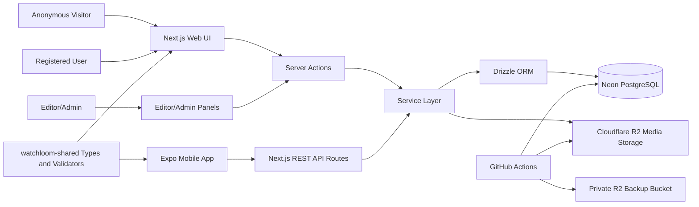
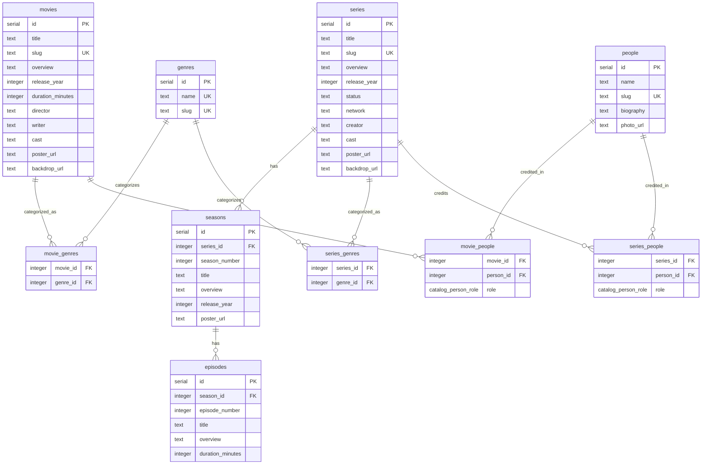

# Watchloom

Watchloom is a multi-platform full-stack movie and TV series catalog application. It provides a public catalog for browsing movies, series, seasons, and episodes, plus authenticated user features for watchlists, favourites, reviews, ratings, and planned watching.

The repository is a Node.js monorepo containing a Next.js web app/backend, an Expo React Native mobile app, and a shared TypeScript package.

## Project Description

Watchloom supports several user roles:

- Anonymous visitors can browse movies and TV series, search the catalog, filter by genre, and open detail pages.
- Registered users can manage watchlists, add movies or series, set watch status, add planned watch dates, write reviews, rate titles, and mark favourites.
- Editors can create, update, and delete catalog content, including movies, series, seasons, episodes, genres, people links, and poster uploads.
- Admins can manage users, roles, active status, contact messages, and catalog administration tools.

The web application is both the browser UI and the backend API used by the mobile app. The mobile app focuses on user-facing catalog, watchlist, favourite, review, and planned-watch workflows.

## Architecture



### Frontend

The web frontend lives in `watchloom-web` and uses:

- Next.js App Router
- React
- TypeScript
- Tailwind CSS
- Server Components and Server Actions
- Reusable component folders for catalog, editor, admin, dashboard, auth, reviews, and watchlists

Important web areas:

- Public pages: home, movies, series, detail pages, reviews, about, contact
- Auth pages: login, register, forgot password, reset password
- User dashboard: watchlists, favourites, reviews, planned items
- Editor area: catalog CRUD for movies, series, seasons, episodes, and poster uploads
- Admin area: users, roles, contact messages, catalog overview

### Backend

The backend is implemented inside the Next.js app:

- Server Actions in `watchloom-web/src/actions`
- REST API routes in `watchloom-web/src/app/api`
- Business logic in `watchloom-web/src/services`
- Authentication helpers in `watchloom-web/src/lib/auth`
- Validation schemas in `watchloom-web/src/lib/validations`
- Database connection and schema in `watchloom-web/src/db`

Server Actions power web form submissions. REST API routes support the mobile app and JSON-based clients.

### Mobile App

The mobile app lives in `watchloom-mobile` and uses:

- Expo
- React Native
- Expo Router
- Expo Secure Store for auth token storage
- Expo Notifications for planned-watch reminders
- API service modules that call the Next.js backend

The mobile app reads the backend URL from `EXPO_PUBLIC_API_BASE_URL`.

### Shared Package

`watchloom-shared` contains shared TypeScript code intended for cross-platform reuse, such as:

- shared types
- constants
- validators
- helper functions

### Database

Watchloom uses Neon PostgreSQL with Drizzle ORM and Drizzle Kit migrations. The schema is defined in `watchloom-web/src/db/schema.ts`.

### File Storage

Cloudflare R2 is used for media assets such as poster uploads. Uploaded poster files are stored in R2 and linked back to catalog rows through `poster_url` fields and `media_assets` records.

### Automation

GitHub Actions is used for CI and backup automation:

- `Build and Test` workflow runs validation checks.
- `Database and Storage Backup` workflow backs up Neon and R2 media to a private R2 backup bucket.

More backup details are documented in `docs/backups.md`.

## Database Schema Design

### Core Catalog Relationships



### User Feature Relationships


### Important Constraints

- `users.email` is unique.
- `movies.slug`, `series.slug`, `genres.slug`, and `people.slug` are unique.
- `series -> seasons -> episodes` uses cascading deletes.
- Join tables use composite uniqueness to prevent duplicate links.
- `watchlist_items`, `reviews`, and `favourites` support either a movie or a series through `media_type` checks.
- Ratings are constrained by database checks.

## Repository Structure

```text
WatchloomApp/
  .github/
    workflows/
      test.yml                 CI workflow for typecheck, lint, tests, build, integration, e2e
      backup.yml               Scheduled/manual database and R2 backup workflow
    scripts/
      run-backup.sh            Backup script used by GitHub Actions

  docs/
    backups.md                 Backup, retention, and restore documentation
    mobile-mvp-checklist.md    Manual mobile smoke checklist

  watchloom-web/
    src/
      app/                     Next.js App Router pages, layouts, API routes
      actions/                 Server Actions for form submissions and protected mutations
      components/              Reusable React UI components
      db/                      Drizzle database connection, schema, seed data
      lib/                     Auth, API, storage, and validation helpers
      services/                Business logic and database access services
      middleware.ts            Route protection and request middleware
    db/scripts/                Catalog maintenance and TMDB import scripts
    drizzle/                   Drizzle migration output
    test/                      Integration test setup and fixtures
    drizzle.config.ts          Drizzle Kit configuration
    package.json               Web/backend scripts and dependencies
    .env.example               Web/backend environment template

  watchloom-mobile/
    app/                       Expo Router screens and routes
    src/
      components/              Mobile UI components
      config/                  Mobile environment config
      constants/               Route and theme constants
      hooks/                   Auth and app hooks
      lib/                     API client, storage, notifications, helpers
      providers/               React providers
      services/                Mobile API service modules
      types/                   Mobile TypeScript types
    app.json                   Expo app configuration
    eas.json                   EAS build configuration
    package.json               Mobile scripts and dependencies
    .env.example               Mobile environment template

  watchloom-shared/
    src/                       Shared TypeScript types, validators, constants, helpers
    package.json               Shared package scripts and dependencies

  package.json                 Root npm workspace scripts
  package-lock.json            npm lockfile
  tsconfig.base.json           Shared TypeScript base config
  README.md                    Project documentation
```

## Local Development Setup

### Prerequisites

Install:

- Node.js `20.19.4` or newer
- npm
- PostgreSQL database, preferably Neon for parity with production
- Git
- Expo tooling for mobile development

Optional but useful:

- Cloudflare R2 bucket for poster upload testing
- TMDB API key/token for catalog import scripts
- Playwright browsers for e2e tests

### 1. Clone the Repository

```bash
git clone <your-repository-url>
cd WatchloomApp
```

### 2. Install Dependencies

```bash
npm install
```

This installs dependencies for all npm workspaces:

- `watchloom-web`
- `watchloom-mobile`
- `watchloom-shared`

### 3. Configure Web Environment Variables

Create a local env file from the template:

```bash
cp watchloom-web/.env.example watchloom-web/.env
```

Fill in the required values:

```env
DATABASE_URL="<your Neon/PostgreSQL connection string>"
JWT_SECRET="<secure random secret>"
TEST_DATABASE_URL="<test database connection string>"
NEXT_PUBLIC_APP_URL="http://localhost:3000"

GOOGLE_CLIENT_ID="<optional Google OAuth client ID>"
GOOGLE_CLIENT_SECRET="<optional Google OAuth secret>"
GOOGLE_REDIRECT_URI="http://localhost:3000/api/auth/google/callback"

TMDB_API_KEY="<optional TMDB key>"
TMDB_API_TOKEN="<optional TMDB token>"
TMDB_API_BASE_URL="https://api.themoviedb.org/3"
TMDB_API_READ_ACCESS_TOKEN="<optional TMDB read token>"
TMDB_IMAGE_BASE_URL="https://image.tmdb.org/t/p/w500"

R2_ACCOUNT_ID="<Cloudflare R2 account ID>"
R2_ACCESS_KEY_ID="<Cloudflare R2 access key>"
R2_SECRET_ACCESS_KEY="<Cloudflare R2 secret key>"
R2_MEDIA_BUCKET_NAME="<optional media bucket name for backups>"
R2_BACKUP_BUCKET_NAME="<optional private backup bucket name>"
R2_ENDPOINT="<R2 S3 endpoint>"
R2_PUBLIC_BASE_URL="<public media base URL>"
R2_REGION="auto"
```

For basic catalog browsing without uploads, R2 values can be skipped until you use poster upload features. For production-like editor uploads, configure R2.

### 4. Configure Mobile Environment Variables

Create the mobile env file:

```bash
cp watchloom-mobile/.env.example watchloom-mobile/.env
```

Set:

```env
EXPO_PUBLIC_API_BASE_URL="http://localhost:3000"
```

For Android emulator, use:

```env
EXPO_PUBLIC_API_BASE_URL="http://10.0.2.2:3000"
```

For a physical device, use your LAN IP:

```env
EXPO_PUBLIC_API_BASE_URL="http://<YOUR_LAN_IP>:3000"
```

### 5. Run Database Migrations

From the repository root:

```bash
npm run db:migrate --workspace watchloom-web
```

Or from `watchloom-web`:

```bash
npm run db:migrate
```

### 6. Seed Development Data

```bash
npm run db:seed --workspace watchloom-web
```

Optional TMDB catalog seed:

```bash
npm run db:seed:tmdb --workspace watchloom-web
```

### 7. Start the Web App

```bash
npm run dev:web
```

The web app runs at:

```text
http://localhost:3000
```

### 8. Start the Mobile App

In a second terminal:

```bash
npm run dev:mobile
```

Then open the app through Expo Go, an emulator, or a simulator.

## Useful Commands

Run all available workspace builds:

```bash
npm run build
```

Lint all workspaces that define lint scripts:

```bash
npm run lint
```

Typecheck all workspaces that define typecheck scripts:

```bash
npm run typecheck
```

Run web tests:

```bash
npm run test --workspace watchloom-web
```

Run web integration tests:

```bash
npm run test:integration --workspace watchloom-web
```

Run Playwright e2e tests:

```bash
npm run test:e2e --workspace watchloom-web
```

Generate Drizzle migrations after schema changes:

```bash
npm run db:generate --workspace watchloom-web
```

Apply Drizzle migrations:

```bash
npm run db:migrate --workspace watchloom-web
```

## API Overview

The web app exposes REST API routes under `watchloom-web/src/app/api`.

Main API areas:

- `/api/auth/*` for login, register, logout, current user, OAuth, password reset
- `/api/movies` and `/api/movies/[slug]`
- `/api/series` and `/api/series/[slug]`
- `/api/series/[slug]/seasons`
- `/api/seasons/[seasonId]/episodes`
- `/api/watchlists`
- `/api/watchlists/[watchlistId]`
- `/api/watchlists/[watchlistId]/items`
- `/api/watchlist-items/[itemId]`
- `/api/favourites`
- `/api/reviews`
- `/api/genres`

The mobile app uses service modules in `watchloom-mobile/src/services` to call these endpoints.

## Authentication and Authorization

Watchloom uses JWT authentication stored in cookies for the web app. Passwords are hashed before storage. Protected routes, Server Actions, and API handlers check the current user and role before allowing mutations.

Roles:

- `user`: regular authenticated user
- `editor`: catalog manager
- `admin`: user/admin/catalog manager

## Storage and Backups

Poster uploads use Cloudflare R2 through the AWS SDK S3 client. The app stores public poster URLs on movie/series rows and records uploaded assets in `media_assets`.

Automated backups are implemented with GitHub Actions:

- Neon PostgreSQL dump as `.sql.gz`
- R2 media bucket archive as `.zip`
- Upload to private R2 backup bucket
- Daily, weekly, and monthly retention

See `docs/backups.md` for setup, verification, and restore instructions.

## Development Guidelines

- Keep shared reusable logic in `watchloom-shared`.
- Keep business logic in `watchloom-web/src/services`.
- Keep route handlers and Server Actions thin.
- Use Drizzle migrations for every database schema change.
- Never commit real `.env` files or secrets.
- Never store plain-text passwords.
- Enforce authorization in protected pages, API routes, and Server Actions.
- Keep UI components focused and reusable.
- Update documentation when setup, architecture, or major behavior changes.

## Deployment Notes

The intended deployment model is:

- Web/backend: serverless Next.js hosting such as Vercel or Netlify
- Database: Neon PostgreSQL
- Media storage: Cloudflare R2
- Backups: GitHub Actions to private Cloudflare R2 bucket
- Mobile: Expo/EAS builds for Android and iOS

Production deployments must configure all required secrets in the hosting provider and GitHub repository settings.
